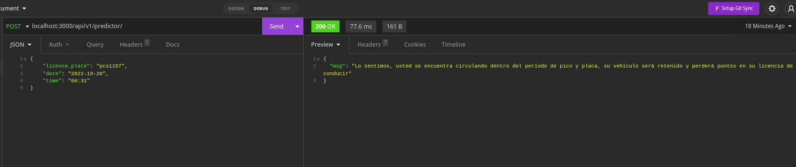
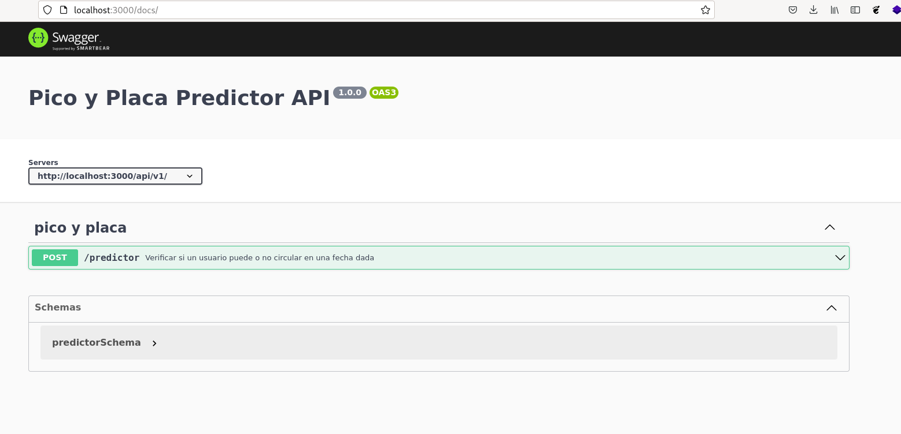

# Pico y Placa Predictor

API para consultar si se encuentra dentro del período de pico y placa en el distrito metropolitano de Quito

## Datos del Pico y Placa

### Días y restricciones

| Día      | Último dígito|
|--------  | -------------|
|Lunes     | 1 y 2        |
|Martes    | 3 y 4        |
|Miércoles | 5 y 6        |
|Jueves    | 7 y 8        |
|Viernes   | 9 y 0       |
|Feriados   | Libre circulación       |
|Fines de semana   | Libre circulación       |

### Horarios

Las horas en las cuales se aplica el pico y placa son:
|Rango  | Horas     |
|-------------|------------|
|Mañana | 06:00 - 09:30   |
|Tarde  | 16:00 - 21:00   |

### Datos de ingreso

- Número de placa: String de 7 caracteres, sin guión. Ejm: ACB12345
- Fecha: String de 10 caracteres separados por guión. Ejm 2022-10-15
- Hora: String entre 5 y 8 caracteres separados por dos puntos. Ejm 12:25 ó 12:25:00

### Con los datos ingresados, se puede obtener los siguientes resultados:

- Pico y Placa: Ud se encuentra dentro del horario de pico y placa, con lo cual perderá sus puntos de licencia y su auto será detenido.
- Pico y Placa - Fuera de horarario: Es el día de restricción de su auto pero se encuentra fuera del horario de restricción. 
- No tiene restricción: No tiene ninguna restricción, puede circular libremente.
- Fin de semana: Libre circulación
- Feriados: Libre circulación.

## Pasos para probar el endpoint

1.Clonar el repositorio

```
git clone https://github.com/juliosarango/pico_placa.git
```

2.Instalar las dependencias

```
npm install
```

3.Iniciar el API

```
npm run dev
```

Una vez levantado el servidor, lo puede probar con clientes como Postman, Imsomnia



También lo puede probar en el navegador

```
http://localhost:3000/docs/
```



## Pasos para ejecutar las pruebas

```
npm run test
```
